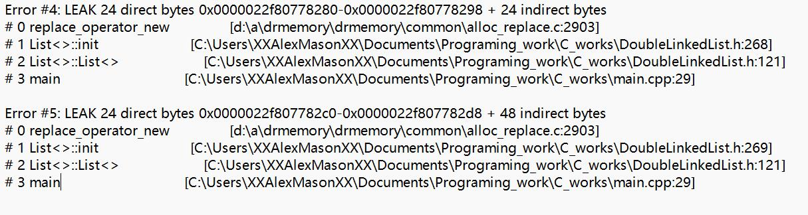

# 双链表的设计和实现
信息与计算科学 南子谦
October 06 2022

## 我的main.cpp（包括main函数和find函数）
我的项目设计思路大体上和课本一致，先定义节点类，在节点的基础上定义迭代器，用于进行数据的储存插入删除等操作；在此过程中重载一些运算符以控制权限及增加便利性。
我的测试测试了push_front,size,empty,erase等函数并自定义了find用于遍历，自定义了printall用于检查所有元素
```
#include"DoubleLinkedList.h"

static List<int>::const_iterator& find(const List<int>& L,int x){
    static List<int>::const_iterator itr;
    int i=1;
    for (itr = L.begin();itr != L.end();itr++,i++){
        if(*itr==x){
            cout << "已找到在第" << i << "个节点" << endl;
            return itr;
        }
    }
    if(itr == L.end()){
        cout << "未找到" << endl;
        static List<int>::const_iterator l;
        return l;
    }
}

void printall(const List<int>& L){
    for (List<int>::const_iterator itr = L.begin();itr != L.end();itr++){
        cout << *itr << " ";
    }
    if(L.size()==0)cout <<"无节点";
    cout << endl;
}

int main(){
    List<int>l1;
    List<int>::const_iterator itr=l1.begin();
    l1.push_front(10);
    l1.push_front(20);
    l1.push_front(30);
    cout << "l1有几个元素?" << l1.size() << endl;
    cout << "l1是否是空的?" << l1.empty() <<endl;
    find(l1,10);

    List<int>::iterator it=l1.begin();
    l1.insert(it,30);
    cout << "l1有几个元素?" << l1.size() << endl;
    printall(l1);
    find(l1,10);

    l1.erase(l1.begin(),l1.end());
    cout << "已清除" << endl;
    cout << "l1有几个元素?" << l1.size() << endl;
    printall(l1);

    return 0;
}
```

## 我的测试结果
```
l1有几个元素?3
l1是否是空的?0
已找到在第3个节点
l1有几个元素?4
30 30 20 10
已找到在第4个节点
已清除
l1有几个元素?0
无节点
```

## 我的内存泄漏检查

虽然我写的析构函数已经包含了delete head和tail内存的操作，但我不知道图中的leak时怎么来的，希望助教指正。