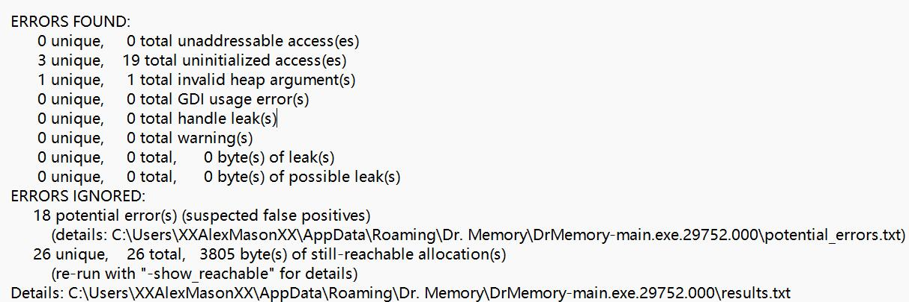
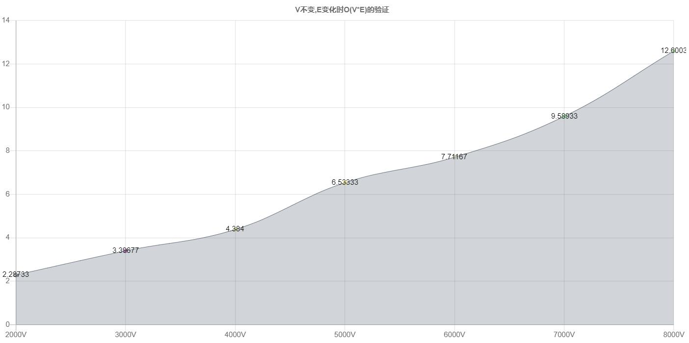

# 12.14 Bellman-Ford算法的实现

南子谦 3210104676 信息与计算科学

## 项目思路
Bellman-ford 算法比dijkstra算法更具普遍性，因为它对边没有要求，可以处理负权边与负权回路。缺点是时间复杂度过高，高达O(VE), V为顶点数，E为边数。
主要思想：
对所有的边进行v-1轮松弛操作，因为在一个含有v个顶点的图中，任意两点之间的最短路径最多包含v-1边。换句话说，第1轮在对所有的边进行松弛后，得到的是源点最多经过一条边到达其他顶点的最短距离；第2轮在对所有的边进行松弛后，得到的是源点最多经过两条边到达其他顶点的最短距离；第3轮在对所有的边进行松弛后，得到的是源点最多经过三条边到达其他顶点的最短距离......若第一轮算法进行了v-1次才完成，意味着有一个点的最短距离经过了v-1条边。
判断有没有负权回路的方法：
再对边进行一次内部循环，如果还有可以松弛的点，那么说明肯定有负权回路。
## 算法完整性的测试
### 相关代码
```
void testListGraph(){
    double* dist;
    ListGraph<int> a(7);
    a.SetVertex();
    a.AddEdge(0,1,1);
    a.AddEdge(1, 2, 1);
    a.AddEdge(2, 4, 1);
    a.AddEdge(4, 3, -3);
    a.AddEdge(3, 2, 1);
    a.AddEdge(1, 5, 4);
    a.AddEdge(1, 6, 4);
    a.AddEdge(5, 6, 5);
    a.AddEdge(6, 7, 4);
    a.AddEdge(5, 7, 3);
    a.listEdges();
    dist=a.bellmanFord(0);
    for(int i=0;i<7;i++){
        cout<<"从顶点0到顶点"<<i<<"的最短路径为："<<dist[i]<<endl;
    }
    delete dist;
}
```
### 输出
若输入错误数据

ArcNode deleted.意味着把New的边结点删除，有几条边就会有几个ArcNode deleted.
若输入正确数据

### 关于内存泄漏

可以看到无内存泄漏
## 验证基本操作的效率
理论上Bellman-Ford算法的时间复杂度为O(V*E)，此算法分为三部分
1. 初始化所有点，将原点的值设为0，时间复杂度为O(V);
2. 进行v-1次循环，在循环内部，遍历所有的边，进行松弛计算，时间复杂度为O(V*E);
3. 进行v-1次循环遍历途中所有的边,判断途中存在从源点可达的权为负的回路，时间复杂度为O(V*E)。
### 与E成正比的证明
因为有n个结点的连通图的边至少有n-1条，最多有 $\frac{n\cdot(n-1)}{2}$ 条，因此我们不妨用一个较多的n个顶点与x(n-1)、(x+1000)(n-1)、……条边来比较。每个x我选择了分别在0，5000，10000三个点求最短路径分别运行3次取平均，以避免偶然性
测试程序：
```
void testtime(int x){//x*n=边数
    double* dist;
    clock_t start,end;

    ListGraph<int> a(10000);
    a.SetVertex();
    for(int j=1;j<=x;j++)
        for(int i=0;i<10000;i++)
            a.AddEdge(i,(i+j)%10000,i);

    start=clock();

    dist=a.bellmanFord(0);
    delete dist;
    dist=a.bellmanFord(5000);
    delete dist;
    dist=a.bellmanFord(10000);
    end=clock();
    cout<<"n=10000,x="<<x<<"的耗时为："<<(double)(end-start)/CLOCKS_PER_SEC/3<<endl;
    delete dist;
}
```
运行结果：
```
a
n=10000,x=2000的耗时为：2.28733
n=10000,x=3000的耗时为：3.39667
n=10000,x=4000的耗时为：4.384
n=10000,x=5000的耗时为：6.53333
n=10000,x=6000的耗时为：7.71167
n=10000,x=7000的耗时为：9.58933
n=10000,x=8000的耗时为：12.6003
```

大体是线性关系。
### 与V成正比的证明
我用不同的n中n个顶点与x/n*n条边来比较，每个n我选择了分别在0，n/2，n三个点求最短路径分别运行3次取平均，以避免偶然性；由于过程类似，结果不在此列出
