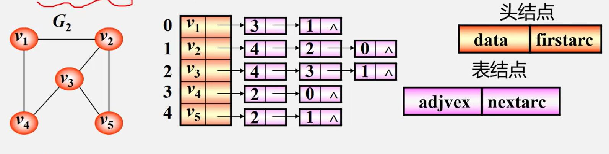
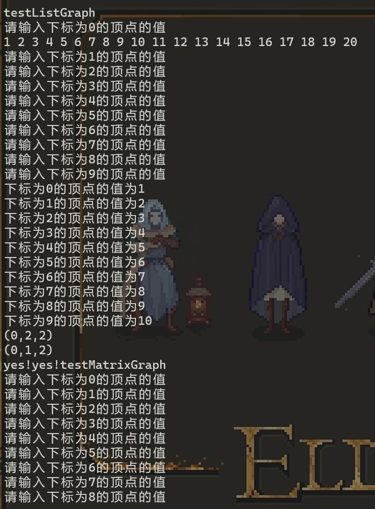
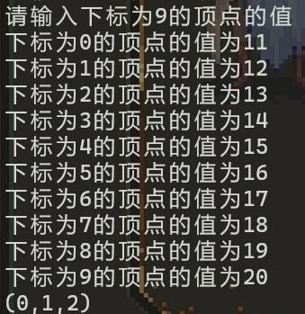

# 图的基本实现
南子谦 信息与计算科学 3210104676

## 各数据结构的关系
图顶点的度：与顶点关联的边的数目，即为TD(v)；在有向图中TD=ID+OD，ID(v)入度是以v为终点的有向边的条数。

图和树：若仅有一个顶点入度为0，其他顶点入度为1，则该图为有向树；所有顶点出度<=2，则为二叉树。而在图的深度优先搜索或广度优先搜索时可以得到图的最小生成树，该树包含图所有顶点的信息。
Kruskal算法：
```
int cmp(const node &c,const node &d)
{
    return c.z<d.z;
}

int find(int x)           //路径压缩（没有按秩合并）的并查集
{
    if (fa[x]!=x)
       fa[x]=find(fa[x]);
    return fa[x];
}

int unionn(int f1,int f2)
{
    fa[f1]=f2;
}

int doit()
{
    int i,j=0;
    int tot=0;
    for (i=1;i<=m;i++)
    {
        int r1=find(way[i].u);
        int r2=find(way[i].v);
        if (r1!=r2)
        {
            tot+=way[i].z;
            unionn(r1,r2);
            j++;
        }
        if (j==n-1) break;
    }
    return tot;
}

void Kruskal()
{
    sort(way+1,way+1+m,cmp);
    int size=doit(); 
}
```

图和链表：将边结点的所有数据融合入顶点结点，即边不带权值，指针融入顶点节点；只有两个顶点度为2，其余顶点度为1，图就变为了链表。或者只留一个顶点，并且把其他边的权值视为顶点的值，就如下图中
- 把除0号顶点的其他顶点去掉
- 把箭头都变为双向
- 添加一个从尾结点指向头节点的指针
  之后得到的类



## 测试程序与数据
在main.cpp中，我预设了顶点值与边的权的数据类型是一致的，或许能够通过在类外定义ArcNode类来实现边与顶点的不同数据类型；其次，我预设了邻接矩阵的comparable为int，因为以我的能力还无法将邻接矩阵中任意数据类型的无边的矩阵元素赋为不可能赋到的值。
在testListGraph之后您会看到两个yes!yes!这是我为了验证析构函数的递归delete起了作用；因此理论上已经不会有内存泄漏。
```
void testListGraph(){
    ListGraph<int> a(10);
    a.SetVertex();
    a.AddEdge(0,1,2);
    a.AddEdge(0,2,2);
    a.listVertexes();
    a.listEdges();
}

void testMatrixGraph(){
    MatrixGraph<int> a(10);
    a.SetVertex();
    a.AddEdge(0,1,2);
    a.listVertexes();
    a.listEdges();
}

int main(){
    cout<<"testListGraph"<<endl;
    testListGraph();
    cout<<"testMatrixGraph"<<endl;
    testMatrixGraph();
    system("pause");
    return 0;
}
```
输出数据


## 一些问题
1. 因为邻接矩阵的容量大小必须在编译时就确定，只能估计一个较大的容量，赌顶点数小于行数；要解决这个问题，或许可以用二维的vector数组。
2. 因为comparable变量难以以常规方法初始化，边中权值数据类型为comparable，因此邻接表中权值难以初始化，邻接矩阵中难以确定一个无边时的comparable值；这或许要用到我现在还未掌握的知识才能解决。