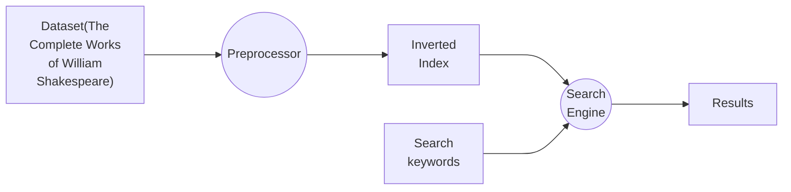
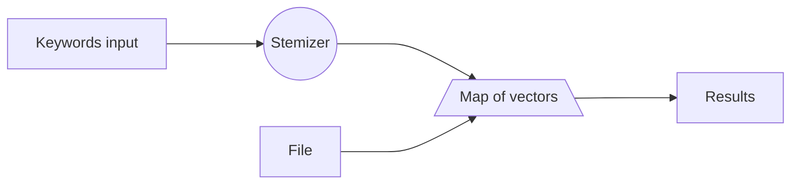

 Mini Search Engine 

 Date: 2023-3.20 

 Author: ** & *** & *** | Group: *

> FYA:    **If you want to run my codes, please check `README.md` first! You can test my code with one command only!**

## Chapter 1: Introduction

### 课题摘要 | Project Abstract

> 本课题中我们将实现一个简单的搜索引擎，范围为 “The Complete Works of William Shakespeare”，实现单词、短语的搜索与文档级精度的定位。

---

> In this project, we will implement a simple search engine, which is based on the "The Complete Works of William Shakespeare". We will implement the search of words and phrases, and the document-level precision positioning.

## Chapter 2: Algorithm Specification

### 流程和结构 | Flow & Structure

### 顶级设计流程 | Top-level flowchart

#### 预处理器 | Preprocessor

#### 搜索引擎 | Search Engine

### 核心逻辑解析 | Core Function Analysis

#### 预处理器 | Preprocessor

预处理器的主要功能是将原始数据集进行预处理，建立倒排索引。

其主要的工作模式是根据预设的路径扫描每一篇文档，得到并处理每一个单词，其中处理包括去除符号以及将所有大写都转化为小写，同时还需要利用第三方库进行 stemming，然后将单词与文档的对应关系存储到倒排索引中。

而这里我们使用了 STL 中的 `map` 和 `vector` 来维护和存储这些数据。具体来说，每当读到一个单词 `word`，我们将它出现的位置 push 进由 `stem(word)` 索引的 `map` 中的一个 `vector` 元素中。这样，我们就可以通过 `stem(word)` 得到一个 `vector`，其中包含了所有包含 `word` 的文档的编号。

由于 stemming 的本质上就是进行一些字符串匹配和替换，所以其复杂度为常数级（毕竟模式是有限的，也没有递归式的 stemming）。

而 `map` 本质上是一个平衡二叉树，例如我们可以通过 AVL 树来实现它，而 AVL 树的原理已经在课内讲过，不再赘述，不同的只有其元素为一个二元组，第一个元素是一个字符串，比较规则是字典序；第二个元素是一个 `vector`，即可变长数组。所以其插入和查找的复杂度均为 $O(\log m)$，$m$ 表示词数，所以总的复杂度为 $O(m\log m)$。

而 `vector` 的 push 操作本质上就是在数组末尾增加一个元素，当数组满了的时候就用 $O(n)$ 的代价倍增数组的内存并进行复制，其均摊复杂度为 $O(1)$，所以总的复杂度为 $O(m)$。由于 OOP using CPP 的习题集中有一道就是需要实现 vector，所以为了防止被抄，在此就不放 vector 的复现代码了。

综上所述，预处理器的总的复杂度为 $O(m\log m + m)$。

此时我们已经有了一个以单词为键，出现位置为值的数据结构了，只需要遍历一遍即可得到所有包含某个单词的文档的编号，并存储下来即可。

---

The main function of the preprocessor is to preprocess the original dataset and build the inverted index.

Its main working mode is to scan each document according to the preset path, get and process each word, where the processing includes removing symbols and converting all uppercase to lowercase, and also needs to use the third-party library for stemming, and then store the correspondence between the word and the document in the inverted index.

Here we use `map` and `vector` in STL to maintain and store these data. Specifically, whenever a word `word` is read, its position is pushed into the `vector` element of the `map` indexed by `stem(word)`. In this way, we can get a `vector` through `stem(word)`, which contains the document numbers containing `word`.

Since the stemming is essentially a string matching and replacement, its complexity is constant (after all, the pattern is finite, and there is no recursive stemming).

And `map` is essentially a balanced binary tree, for example, we can use AVL tree to implement it, and the principle of AVL tree has been taught in class, so we won't elaborate on it. The only difference is that its elements are a pair, the first element is a string, and the comparison rule is dictionary order; the second element is a `vector`, that is, a variable-length array. So its insertion and search complexity are both $O(\log m)$, so the total complexity is $O(m\log m)$.

And the push operation of `vector` is essentially to add an element to the end of the array. When the array is full, it uses $O(n)$ to double the memory of the array and copy it, and its amortized complexity is $O(1)$, so the total complexity is $O(m)$. Since there is a problem in the OOP using CPP exercise set that requires the implementation of vector, so in order to prevent being copied, the vector's replication code is not put here.

In summary, the total complexity of the preprocessor is $O(m\log m + m)$.

At this point, we already have a data structure with words as keys and positions as values, and we only need to traverse it once to get the document numbers containing a certain word and store them.

#### 搜索引擎 | Search Engine

搜索引擎的主要功能是根据用户输入的关键词，返回相关的文档位置。

首先我们考虑单个单词的情况，其主要工作模式是根据用户输入的单词，但是不能直接用它进行搜索，而是需要先进行 stemming，然后再进行搜索。而这里显然只有一个常数级别的复杂度，所以我们直接忽略。在经过 stemming 之后，我们就可以直接在倒排索引中查找了，得到一个 `vector`，其中包含了所有包含 `word` 的文档的编号。

但这些操作还不够，我们还需要剔除 stop word。具体做法是当匹配出来的东西的数量大于一定值时，被认定为过于频繁的出现，这时就需要剔除。这里我们取了一个大约 4k 的阈值。

而当用户输入的关键词有多个的时候，我们就需要对各个单词的搜查结果做交集。

取交集的过程我们实现的比较暴力，假设 $Int_i$ 表示前 i 个单词的结果的交集，那么我们就可以得到 $Int_{i+1} = Int_i \cap res_{i+1}$，其中 $Int_0 = \text{Inverted Index}$。这一步的复杂度大概是 $O(k^2n)$，其中 $k$ 是一个常数，表示 documents 的数量，$n$ 表示有多少个用户指定的搜索关键词。

由于实现过程中的一些技术内容和预处理器基本类似，所以不再赘述。其复杂度也和预处理器一样是 $O(m\log m)$ 级的。

---

The main function of the search engine is to return the document location according to the keywords entered by the user.

First we consider the case of a single word, its main working mode is to search according to the word entered by the user, but it cannot be searched directly, but needs to be stemmed first, and then searched. Here it is obviously a constant-level complexity, so we directly ignore it. After stemming, we can directly search in the inverted index and get a `vector`, which contains all the document numbers containing `word`.

But these operations are not enough, we still need to remove stop words. The specific method is that when the number of matches exceeds a certain value, it is considered to be too frequent, and then it needs to be removed. Here we took a threshold of about 4k.

When there are multiple keywords entered by the user, we need to take the intersection of the search results of each word.

The process of taking the intersection is implemented more brutally. Suppose $Int_i$ represents the intersection of the first i words, then we can get $Int_{i+1} = Int_i \cap res_{i+1}$, where $Int_0 = \text{Inverted Index}$. The complexity of this step is about $O(k^2n)$, where $k$ is a constant, representing the number of documents, and $n$ represents how many user-specified search keywords there are.

Since some of the technical content in the implementation process and the preprocessor are basically the same, they will not be elaborated. Its complexity is also $O(m\log m)$ like the preprocessor.

## Bonus

有 500000 个文件代表着我们的每一个单词可能有 $5 \times 10^5$ 种出现的位置（假设我们的精度只考虑文件级）。400000000 个不同的词则表示我们可能有 $4 \times 10^8$ 条记录。

虽然我们这里由于文件数量少，直接使用了 string 来表示文件索引，但是文件多了以后这种方法就不可取了，因为这会带来较大的存储空间。所以我们使用编号来表示。而这么多文件，所需要的比特数为 $\lceil \log_2{500000} \rceil= 19$，即我们需要四个字节来存储文件索引。

这样的话，我们的倒排索引就需要 $4 \times 10^8 \times 5 \times 10^5 \times 4 = 8 \times 10^{14}$ 个字节，也就是 800TB 的空间。而我们的数据在处理完之前都是存在内存里的，别说内存了，个人电脑即使使用硬盘也难以存下这些数据。此外，从复杂度上来讲，指数为 14 的数量级对于个人电脑来说已经过于困难了。所以我们的程序无法胜任这项工作——但是这个分析是基于我们使用邻接矩阵来存储这些信息这个假设的，而如果使用一些更聪明的办法，例如链表，或者 vector，我们的内存消耗就只有 $4 \times 10^8$ 条记录，也就是 1600MB，此时我们就不再能指望继续用内存来实现了。因此我们必须考虑将信息存储到硬盘，再根据需求从文件中读取所需要的部分来修改。为此我们可能会需要数据库的帮助。

而耗时在这个过程中变成了 $O(m\log m) \sim 1e7$，但是有较大常数。所以仍然不太可观。

当然，这不是我们的话题，但是至少能得到结论，我们的程序无法承担这项任务。

---

There are 500000 files, which means that each of our words may have $5 \times 10^5$ possible positions (assuming that our accuracy only considers file-level). 400000000 different words then means that we may have $4 \times 10^8$ records.

Although we use string to represent the file index here because the number of files is small, this method is not feasible when there are many files, because it will bring a large amount of storage space. So we use the number to represent it. And so many files, the number of bits needed is $\lceil \log_2{500000} \rceil= 19$, that is, we need four bytes to store the file index.

In this way, our inverted index needs $4 \times 10^8 \times 5 \times 10^5 \times 4 = 8 \times 10^{14}$ bytes, that is, 800TB of space. And our data is all stored in memory before processing, not to mention memory, even if personal computers use hard disks, it is difficult to store such data. In addition, from the point of view of complexity, the exponent of 14 is already too difficult for personal computers. So our program can not handle this job - but this analysis is based on the assumption that we use the adjacency matrix to store this information, and if we use some smarter methods, such as linked lists, or vectors, our memory consumption will only be $4 \times 10^8$ records, that is, 1600MB, at this time we will no longer be able to expect to continue to use memory to implement it. Therefore, we must consider storing the information on the hard disk and then reading the required part from the file according to the demand to modify it. For this we may need the help of the database.

And the time spent in this process becomes $O(m\log m) \sim 1e7$, but there is a large constant. So it's still not very good.

Of course, this is not our topic, but at least we can get the conclusion that our program can not handle this task.

# Declaration

We hereby declare that all the work done in this project titled  "Mini Search Engine" is of our independent effort.