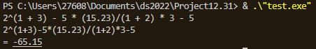
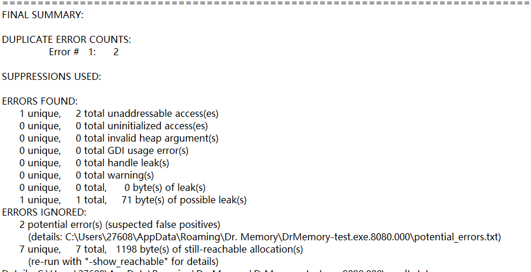
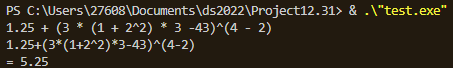
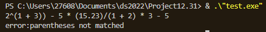
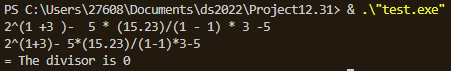

<<<<<<< HEAD
# 五则运算计算器的实现

南子谦 信息与计算科学 3210104676

## 设计思路的说明

五则运算计算器的时间，有两个关键步骤，一是把中缀表达式转换为后缀表达式，二是计算后缀表达式的值。

### 后缀表达式的转换

为什么我们要转换为后缀表达式呢？我们习惯主谓宾的语言表达，也习惯于中缀表达式的计算。因为我们看一眼就能根据括号和符号的优先级快速判断从何处开始运算，把一次复杂计算分成众多个主谓宾，所以一次复杂的五则运算花不了我们多长时间。但是计算器难以做到，它们若要进行中缀表达式的计算，需要一遍遍地遍历以确定每次计算后优先级最高的地方在哪，这就徒增了很大的时间成本。事实上，后缀表达式与栈的思想更适合计算机的运算，它们只要扫描一次就能运算完后缀表达式。

将中缀表达式转换为后缀表达式，或者将中缀表达式转化为一个树，都要用到栈。

**转换算法：**

stackop:=> 存放运算符的栈

stacknum:=> 存放结点和子树的栈

遍历表达式，(1-2)*3  :expression

while expression仍未读完

case 1:  字符是数字时，构造一个此value为此数字的节点 （例如如果是‘1’， 则生成     1    这样的结点）

    /     \

  null  null

case 2:  字符为右括号，一直弹出stackop的操作符。当比stackop栈顶操作符优先级高时作为父节点，从stacknum弹出的适量结点为子结点，整体压入stacknum；若低于则弹出stack1的栈顶操作符，以弹出的操作符为父结点， 以从stacknum弹出的适量结点为子结点，整体压入stacknum，直至比stackop栈顶操作符优先级高。直至弹出左括号。

case 3: 字符是操作符时，则根据上面的优先级关系， 当比stackop栈顶操作符优先级高或stackop空时压入stackop；若<=则弹出stackop的栈顶操作符，以其为父结点， 以从stacknum弹出的适量结点为子结点，整体压入stacknum，直至比stackop栈顶操作符优先级高。因为^是从后往前计算，因此^的优先级和本身相比时要高。

expression读完

从stackop弹出操作符，根据上面的优先级关系， 当比stackop栈顶操作符优先级高时作为父节点，从stacknum弹出的适量结点为子结点，整体压入stacknum；若低于则弹出stack1的栈顶操作符，以弹出的操作符为父结点， 以从stacknum弹出的适量结点为子结点，整体压入stacknum，直至比stackop栈顶操作符优先级高。

例如(1-2)*3的树为

    *

    /       \

    -             3

    /       \        /   \

    1          2    null  nul

   /     \      /   \

  null  null null null

### 计算后缀表达式的值

因为我用一个vector `<char>`来存储数字与符号，因此在树的底层时需要Converttodouble函数把数字变为double类型。

```cpp
double CalculateTree(TreeNode* x){
        if(!(x->val[0]=='+'||x->val[0]=='-'||x->val[0]=='*'||x->val[0]=='/'||x->val[0]=='^'))
            return Converttodouble(x->val);
        if(x->val[0]=='+'){
            return CalculateTree(x->left)+CalculateTree(x->right);
        }
        if(x->val[0]=='-'){
            return CalculateTree(x->left)-CalculateTree(x->right);
        }
        if(x->val[0]=='*'){
            return CalculateTree(x->left)*CalculateTree(x->right);
        }
        if(x->val[0]=='/'){
            return CalculateTree(x->left)/CalculateTree(x->right);
        }
        if(x->val[0]=='^'){
            return pow(CalculateTree(x->left),CalculateTree(x->right));
        }
    }
```

## 测试思路的说明

`2ˆ(1 + 3) − 5 ∗ (15.23)/(1 + 2) ∗ 3 − 5`
可以检验括号是否正确运算，乘法和加减法的顺序是否正确

运行结果

无内存泄漏

`1.25 + (3 ∗ (1 + 2ˆ2) ∗ 3 − 43)ˆ(4 − 2)`
可以检验乘方的正确运算

运行结果

`2ˆ(1 + 3)) − 5 ∗ (15.23)/(1 + 2) ∗ 3 − 5`
可以检验括号不匹配的问题。

运行结果

`2ˆ(1 + 3) − 5 ∗ (15.23)/(1 − 1) ∗ 3 − 5`
可以检验除数为0的问题

运行结果
=======
# 五则运算计算器的实现

南子谦 信息与计算科学 3210104676

## 设计思路的说明

五则运算计算器的时间，有两个关键步骤，一是把中缀表达式转换为后缀表达式，二是计算后缀表达式的值。

### 后缀表达式的转换

为什么我们要转换为后缀表达式呢？我们习惯主谓宾的语言表达，也习惯于中缀表达式的计算。因为我们看一眼就能根据括号和符号的优先级快速判断从何处开始运算，把一次复杂计算分成众多个主谓宾，所以一次复杂的五则运算花不了我们多长时间。但是计算器难以做到，它们若要进行中缀表达式的计算，需要一遍遍地遍历以确定每次计算后优先级最高的地方在哪，这就徒增了很大的时间成本。事实上，后缀表达式与栈的思想更适合计算机的运算，它们只要扫描一次就能运算完后缀表达式。

将中缀表达式转换为后缀表达式，或者将中缀表达式转化为一个树，都要用到栈。

**转换算法：**

stackop:=> 存放运算符的栈

stacknum:=> 存放结点和子树的栈

遍历表达式，(1-2)*3  :expression

while expression仍未读完

case 1:  字符是数字时，构造一个此value为此数字的节点 （例如如果是‘1’， 则生成     1    这样的结点）

    /     \

  null  null

case 2:  字符为右括号，一直弹出stackop的操作符。当比stackop栈顶操作符优先级高时作为父节点，从stacknum弹出的适量结点为子结点，整体压入stacknum；若低于则弹出stack1的栈顶操作符，以弹出的操作符为父结点， 以从stacknum弹出的适量结点为子结点，整体压入stacknum，直至比stackop栈顶操作符优先级高。直至弹出左括号。

case 3: 字符是操作符时，则根据上面的优先级关系， 当比stackop栈顶操作符优先级高或stackop空时压入stackop；若<=则弹出stackop的栈顶操作符，以其为父结点， 以从stacknum弹出的适量结点为子结点，整体压入stacknum，直至比stackop栈顶操作符优先级高。因为^是从后往前计算，因此^的优先级和本身相比时要高。

expression读完

从stackop弹出操作符，根据上面的优先级关系， 当比stackop栈顶操作符优先级高时作为父节点，从stacknum弹出的适量结点为子结点，整体压入stacknum；若低于则弹出stack1的栈顶操作符，以弹出的操作符为父结点， 以从stacknum弹出的适量结点为子结点，整体压入stacknum，直至比stackop栈顶操作符优先级高。

例如(1-2)*3的树为

    *

    /       \

    -             3

    /       \        /   \

    1          2    null  nul

   /     \      /   \

  null  null null null

### 计算后缀表达式的值

因为我用一个vector `<char>`来存储数字与符号，因此在树的底层时需要Converttodouble函数把数字变为double类型。

```cpp
double CalculateTree(TreeNode* x){
        if(!(x->val[0]=='+'||x->val[0]=='-'||x->val[0]=='*'||x->val[0]=='/'||x->val[0]=='^'))
            return Converttodouble(x->val);
        if(x->val[0]=='+'){
            return CalculateTree(x->left)+CalculateTree(x->right);
        }
        if(x->val[0]=='-'){
            return CalculateTree(x->left)-CalculateTree(x->right);
        }
        if(x->val[0]=='*'){
            return CalculateTree(x->left)*CalculateTree(x->right);
        }
        if(x->val[0]=='/'){
            return CalculateTree(x->left)/CalculateTree(x->right);
        }
        if(x->val[0]=='^'){
            return pow(CalculateTree(x->left),CalculateTree(x->right));
        }
    }
```

## 测试思路的说明

`2ˆ(1 + 3) − 5 ∗ (15.23)/(1 + 2) ∗ 3 − 5`
可以检验括号是否正确运算，乘法和加减法的顺序是否正确

运行结果

无内存泄漏

`1.25 + (3 ∗ (1 + 2ˆ2) ∗ 3 − 43)ˆ(4 − 2)`
可以检验乘方的正确运算

运行结果

`2ˆ(1 + 3)) − 5 ∗ (15.23)/(1 + 2) ∗ 3 − 5`
可以检验括号不匹配的问题。

运行结果

`2ˆ(1 + 3) − 5 ∗ (15.23)/(1 − 1) ∗ 3 − 5`
可以检验除数为0的问题

运行结果
>>>>>>> 265a7754094319680e3f3f9ba96495fb3462af33
